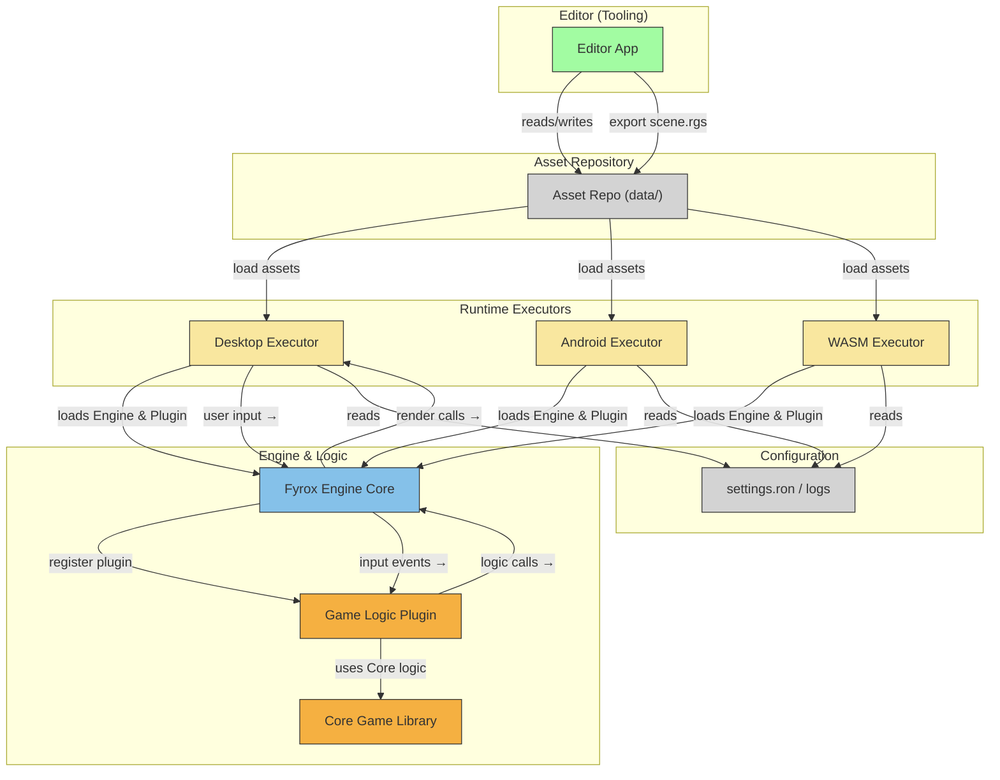

## 2D Single Player Rust Game

Welcome to your next favorite 2D single player game, built in Rust!  
This project leverages the power of the [Fyrox](https://fyrox.rs/) game engine for smooth 2D gameplay, dynamic entities, and a robust scripting system.

---

### 🚀 Features

- **Single Player Action:** Control your player in a vibrant 2D world.
- **Dynamic Enemies:** Skeleton bots spawn every 10 seconds—defeat them to increase your score!
- **Health System:** Take damage, heal with hearts, and watch your health bar update in real time.
- **Power-Ups & Hazards:** Collect hearts to heal, but watch out for bombs, since they can turn the game around by dealing tons of damage or the fire!
- **Game Over & Restart:** Lose all your health? Instantly restart or exit with a keypress.
- **Smooth Controls:** Move with WASD or arrow keys, use Space to take damage (for testing), R to restart, and Esc to exit.

---

### 🎮 Controls

| Key             | Action                        |
|-----------------|------------------------------|
| W / Up Arrow    | Move Up                      |
| S / Down Arrow  | Move Down                    |
| A / Left Arrow  | Move Left                    |
| D / Right Arrow | Move Right                   |
| Space           | Take Damage (test)           |
| R               | Restart (after Game Over)    |
| Esc             | Exit Game (after Game Over)  |

---

### 🧩 Gameplay Overview

- **Enemies:** Skeleton bots spawn periodically and become visible at the center of the map.
- **Health:** Your player starts with 100 health. When health drops below 50, a heart appears—collect it to restore health.
- **Items:** Bombs spawn every 30 seconds. Catch them to deal damage to bots depending on radius! Fire spawns every 30 seconds, deals damage to all bots on the map for a period of time!
- **Game Over:** If health reaches zero, the game displays a message and waits for your input to restart or quit.

---

### 🛠️ Getting Started

#### **Prerequisites**
- Rust (latest stable)
- [Fyrox Engine](https://fyrox.rs/) and its dependencies

#### **Build & Run**

```bash
git clone https://github.com/davide-perli/Nysodi.git
cd Nysodi
cd nysodi
cargo run --package editor --release
```

---

### 📁 Project Structure

- `src/`
  - `bot.rs` – Enemy bot logic
  - `player.rs` – Game entry point and plugin setup, player movement, health, and item logic
- `assets/`
  - `scene.rgs` – Game scene resource
  - `heart.png` – Heart item sprite
  - `bomb.png` – Bomb item sprite
  - `fire.png` - Fire item sprite

---

### 🖼️ Screenshots

> _Add your gameplay screenshots here!_

---

### ⚡ Example Code Snippet

```rust
fn on_update(&mut self, context: &mut ScriptContext) {
    self.update_health_bar(context);

    if self.health  _“Built with Rust, powered by passion.”_
```

---

## 🗺️ Architecture Overview



---

**Tips:**
- On GitHub, Mermaid diagrams are supported in Markdown files (as of 2024).
- If your platform does not render Mermaid, you can use [Mermaid Live Editor](https://mermaid.live/) to generate a PNG/SVG and embed that as an image.

Let me know if you want a brief description or legend for each component!

[1] https://ppl-ai-file-upload.s3.amazonaws.com/web/direct-files/attachments/44406737/923017d3-95dc-4806-9853-a998cce0d7d7/paste.txt
[2] https://ppl-ai-file-upload.s3.amazonaws.com/web/direct-files/attachments/44406737/58c7ff58-9649-4b27-9cad-2c049a15db1c/paste-2.txt

---

## ⚠️ License

This project is free for personal and non-commercial use.
If you wish to use this project or its code for commercial purposes, you must obtain a commercial license.

See LICENSE.txt for full details.

---

### 🤝 Contact

**Perli Davide**  
📧 [perlidavide@gmail.com](mailto:perlidavide@gmail.com)

**Andra Alexandrescu**  
📧 [alexandrecuandra2005@gmail.com](mailto:alexandrecuandra2005@gmail.com)

**Project Link:**  
🔗 [github.com/davide-perli/Nysodi](https://github.com/davide-perli/Nysodi)

---

