## 2D Single Player Rust Game

Welcome to your next favorite 2D single player game, built in Rust!  
This project leverages the power of the [Fyrox](https://fyrox.rs/) game engine for smooth 2D gameplay, dynamic entities, and a robust scripting system.

---

### 🚀 Features

- **Single Player Action:** Control your player in a vibrant 2D world.
- **Dynamic Enemies:** Skeleton bots spawn every 10 seconds—defeat them to increase your score!
- **Health System:** Take damage, heal with hearts, and watch your health bar update in real time.
- **Power-Ups & Hazards:** Collect hearts to heal, but watch out for bombs, since they can turn the game around by dealing tons of damage or the fire!
- **Game Over & Restart:** Lose all your health? Instantly restart or exit with a keypress.
- **Smooth Controls:** Move with WASD or arrow keys, use Space to take damage (for testing), R to restart, and Esc to exit.

---

### 🎮 Controls

| Key             | Action                        |
|-----------------|------------------------------|
| W / Up Arrow    | Move Up                      |
| S / Down Arrow  | Move Down                    |
| A / Left Arrow  | Move Left                    |
| D / Right Arrow | Move Right                   |
| Space           | Take Damage (test)           |
| R               | Restart (after Game Over)    |
| Esc             | Exit Game (after Game Over)  |

---

### 🧩 Gameplay Overview

- **Enemies:** Skeleton bots spawn periodically and become visible at the center of the map.
- **Health:** Your player starts with 100 health. When health drops below 50, a heart appears—collect it to restore health.
- **Items:** Bombs spawn every 30 seconds. Catch them to deal damage to bots depending on radius! Fire spawns every 30 seconds, deals damage to all bots on the map for a period of time!
- **Game Over:** If health reaches zero, the game displays a message and waits for your input to restart or quit.

---

### 🛠️ Getting Started

#### **Prerequisites**
- Rust (latest stable)
- [Fyrox Engine](https://fyrox.rs/) and its dependencies

#### **Build & Run**

```bash
git clone https://github.com/davide-perli/Nysodi.git
cd Nysodi
cd nysodi
cargo run --package editor --release
```

---

### 📁 Project Structure

- `src/`
  - `bot.rs` – Enemy bot logic
  - `lib.rs` – Game entry point and plugin setup, player movement, health, and item logic
- `assets/`
  - `scene.rgs` – Game scene resource
  - `heart.png` – Heart item sprite
  - `bomb.png` – Bomb item sprite
  - `fire.png` - Fire item sprite

---

### 🖼️ Screenshots

<p align="center">
  
  <br/>
  
</p>

---

## 🧪 Game Demo

Click below to view game demo!

🎮 **[View the Demo](https://youtu.be/tj5efI2Rw-w)**

---

### ⚡ Example Code Snippet

```rust
fn on_update(&mut self, context: &mut ScriptContext) {
    self.update_health_bar(context);

    if self.health  _“Built with Rust, powered by passion.”_
```

## 🧩 Entity Relationship Diagram


---

## Combat Rythm Diagram

---

## 🏗️ Main Class Structure


---

## 🗺️ Architecture Overview

```mermaid
flowchart LR
    %% Editor & Tooling
    subgraph "🛠️ Editor & Tooling"
        EditorApp["Editor App"]
    end

    %% Asset Repository
    subgraph "📦 Asset Repository"
        AssetStore["Asset Store (nysodi/data/)"]
    end

    %% Game Logic
    subgraph "🧠 Game Logic"
        GameLogicPlugin["Game Logic Plugin (cdylib)"]
        CoreGame["Core Game Logic (game crate)"]
    end

    %% Engine Core
    subgraph "⚙️ Fyrox Engine"
        FyroxEngine["Fyrox Engine"]
    end

    %% Runtimes
    subgraph "🖥️ Runtimes"
        ExecutorDesktop["Executor-Desktop"]
        ExecutorWASM["Executor-WASM"]
        ExecutorAndroid["Executor-Android"]
    end

    %% Platform Hosts
    subgraph "🌐 Platform Hosts"
        Browser["Browser Host"]
        AndroidOS["Android OS Host"]
    end

    %% Connections
    EditorApp -- "calls rendering/input" --> FyroxEngine
    ExecutorDesktop -- "calls rendering/input" --> FyroxEngine
    ExecutorWASM -- "calls rendering/input" --> FyroxEngine
    ExecutorAndroid -- "calls rendering/input" --> FyroxEngine

    EditorApp -- "load_scene(), load_assets" --> AssetStore
    ExecutorDesktop -- "load_scene(), load_assets" --> AssetStore
    ExecutorWASM -- "load_scene(), load_assets" --> AssetStore
    ExecutorAndroid -- "load_scene(), load_assets" --> AssetStore

    EditorApp -- "load_plugin()" --> GameLogicPlugin
    ExecutorDesktop -- "load_plugin()" --> GameLogicPlugin
    ExecutorWASM -- "load_plugin()" --> GameLogicPlugin
    ExecutorAndroid -- "load_plugin()" --> GameLogicPlugin

    GameLogicPlugin -- "invoke_on_init(), on_update()" --> CoreGame

    ExecutorWASM -- "WebGL, JS glue (main.js)" --> Browser
    ExecutorAndroid -- "JNI bridge" --> AndroidOS

    %% Clickable links for GitHub
    click EditorApp "https://github.com/davide-perli/nysodi/tree/main/nysodi/editor/"
    click ExecutorDesktop "https://github.com/davide-perli/nysodi/tree/main/nysodi/executor/"
    click ExecutorWASM "https://github.com/davide-perli/nysodi/tree/main/nysodi/executor-wasm/"
    click ExecutorAndroid "https://github.com/davide-perli/nysodi/tree/main/nysodi/executor-android/"
    click GameLogicPlugin "https://github.com/davide-perli/nysodi/tree/main/nysodi/game-dylib/"
    click CoreGame "https://github.com/davide-perli/nysodi/tree/main/nysodi/game/"
    click AssetStore "https://github.com/davide-perli/nysodi/tree/main/nysodi/data/"

    %% Styling
    classDef engine fill:#cce5ff,stroke:#004085,stroke-width:2px;
    classDef game fill:#d4edda,stroke:#155724,stroke-width:2px;
    classDef assets fill:#fff3cd,stroke:#856404,stroke-width:2px;
    classDef platform fill:#e2dfff,stroke:#4b0082,stroke-width:2px;
    class EditorApp,ExecutorDesktop,ExecutorWASM,ExecutorAndroid engine;
    class FyroxEngine engine;
    class GameLogicPlugin,CoreGame game;
    class AssetStore assets;
    class Browser,AndroidOS platform;
```


## 👤📖 User stories and acceptance criteria

### SCRUM-1 User walks around a map  

### Description

As a player I can walk around a map in all directions, being bounded by some limits that have collisions enabled.  

### Acceptance criteria  
- The player can move the character up, down, left, and right using input controls.  
- The character stops moving when colliding with obstacles.  
- The character cannot move outside the defined map boundaries.

### Overview
Implemented player's nodes using Fyrox's official guide: [Character Controller Tutorial](https://fyrox-book.github.io/tutorials/platformer/part1.html).
The player is an entity with colliding properties, a BodySprite and a Camera to follow his movement.
The border is formed out of CenterTiles which contain Collider 2D items, initially also including 2D Rectangle Sprites, which were later removed after the SCRUM in which the map was designed, in order for the player to still be limited to a certain area with colliders made invisible.

### Scene Management
- Handles scene loading via `on_scene_loaded`
- Tracks active scene handle
- Cleans up previous scenes when loading new ones

### Player Movement
- Arrow/WASD keys for movement
- 3.0 units/second movement speed
- Sprite flips based on movement direction

### SCRUM-9 Enemy targets the player once it appears on the map

### Description

As an enemy I need to target the player as soon as I acknowledge his presence and follow him around the xOy plane.

### Acceptance criteria
- The enemy detects the player as soon as they enter a predefined detection range
- The enemy only detects when collision with the player occurs
- The enemy has different animations

### Overview
Implemented enemy's nodes using Fyrox's official guide: [Bots and AI Tutorial](https://fyrox-book.github.io/tutorials/platformer/part2.html).
The enemy is an entity with colliding properties, animations, a BodySprite, a FrontObstacleSensor and a BackObstacleSensor.
The enemy has multiple animations which change based on his behaviour, meaning when it gets closer the attack animation is triggered otherwise the idle and walk animations are activated.
The enemy locates and moves towards the target at any given moment.

### Distance Calculation
The code uses `metric_distance()` between:
- `target_position`: Player's global position
- `self_position`: Bot's own global position

### Target Location
- **`locate_target`**: Sets the player as the bot's target by getting the player handle from the Game plugin.
- **`move_to_target`**: Calculates direction and speed based on distance to player:
  - Moves toward player if distance > 1.1 units
  - Stops when within 1.1 units

### Enemy Movement
- **`do_move`**: Applies velocity to the bot's rigidbody and flips sprite to face player
  - Sets velocity based on direction and speed
  - Flips sprite based on player position
  - Zeroes velocity when bot is not visible

### State Determination
The system uses three primary animation states:
1. **Attack (Index 0)**: Triggered when:
   - The bot has a target (player)
   - The bot is within 1.4 units of the player (attack range)
2. **Walk (Index 2)**: Triggered when:
   - The bot is moving (direction vector has non-zero x or y components)
   - Either has a target but is outside attack range, or has no target but is moving
3. **Idle (Index 3)**: Default state when:
   - The bot is not moving
   - Has no target or isn't close enough to attack

### SCRUM-10 User has a health bar corresponding to one heart

### Description

As a player, I want to be able to survive based on a full health bar which decreases by a predefined number of points, meaning I have left a few chances to continue the game. As an enemy, I want the same functionality so I am able to be defeated.

### Acceptance criteria
- Player/ Enemy has one life, having a full health bar associated
- If the player’s/ enemy's health reaches zero, the health bar reaches zero
- After the health bar reaches zero, the game stops and it prompts you to restart or escape the game

### Overview
Both entities now include HeartFill and HealthBackground sprites which are associated with the corresponding attributes `health`, `max_health` and `health_fill_handle`.
The positioning of these sprites needed multiple interventions, taking into consideration that HeartFill should be layered on top of HeartBackground.
In order top test this SCRUM, since no damage between the entities is implemented and to prove the logic for `update_health_bar()`, the player decreases its own health by pressing the spacebar.

### Health Values
- Max health: 100
- Game over at 0 health
- Health bar visualization and scaling
- `update_health_bar()`: Syncs visual health display based on the proven formula - **(full_width - health_ratio * full_width) / 200.0**
- Debug/testing functionality to simulate taking damage by pressing the spacebar

### SCRUM-2 Various regeneration items appear/ disappear on the map

### Description

As a player, I want to be able to see and have access to items that randomly appear on the map so that I can heal the damage caused by my enemy (items which are represented as hearts, increasing the health by a certain percentage).

### Acceptance criteria
- Items spawn randomly on the map at predefined locations within a specified radius from the player
- Health regeneration items only improve the player’s health bar by a predefined value
- Items appear on the map only when the player has taken multiple hits and is lower that 50 percent
- Items disappear after a few seconds of inactivity if the player hasn’t reached for them
- The player collides with the freshly spawned items and they increase his health

### Overview
The heart item is not present in `scene.rgs` as an item having multiple children nodes, it is instead fully implemented in the game in `lib.rs` and it is referred to as **heart**.
Players below 50 percent must decide whether to seek out hearts or continue the game without healing.
Random heart item spawns encourage map exploration and the 5-second timer is necessary in combat scenarios, meaning the hearts have a limited lifetime in which they could heal the player.
The `health_fill_handle` attribute is now associated with this logic.

### Recovery and heart item logic
- Hearts spawn randomly withing a 5 units radius from the player when health < 50
- Hearts restore 30 health
- 5 second lifespan before disappearing
- Pulsing visual effect - **let pulse_scale = 0.7 + 0.1 * (self.heart_pulse_timer * 3.0).sin()**
- `spawn_heart()`: Creates health pickup item near player
- Player must touch the heart (hitbox <1.0 unit distance) - **if (player_pos - heart_pos).norm() < 1.0**
- Cooldown System: Only one heart exists at a time (anti-farming safeguards)
- State Tracking: Remembers last health value to prevent respawn glitches

### SCRUM-4 Enemy attacks the player and vice versa

### Description

As the enemy, I have the ability to cause damage to the player. As a player I have the ability to deal damage to the enemy. As active entities, we both are susceptible to having our health damaged. As a player, my goal is to survive as long as possible without dying by defeating multiple bots which are part of a repeated cycle of dying/ respawning, and using weapons and items strategically. The score increases based on the number of enemy deaths.

### Acceptance criteria
- Each attack is only allowed within 1 unit distance
- Since the player can abuse the attack by pressing the assigned attack key very fast, the attack power is way lower than the enemy’s, otherwise the enemy would’ve been in disadvantage
- To note that the player’s low attack power is also due to the fact that the player has access to explosive items to use against the enemy
- Score is solely based on the number of times the enemies have been defeated
- After the player has been defeated, the game stops and the player either chooses to restart or to escape the game
- The enemy’s death is followed by its respawn within the player’s range

### Overview
The enemy deals damage to the player when close enough and visible, using a damage timer to limit the attack frequency. The bot receives damage by updating its health, triggers death/respawn logic when health reaches zero, and updates its health bar accordingly.

Similarly, the player damage is handled by reducing the player's health when attacked by a bot. The player's health is decreased by 20 points when a bot is close enough and visible, with a cooldown to prevent rapid hits.

### Attack
- Both player and enemy attacks only register within 1.0 unit distance
- Deal 20 damage per hit (enemy -> player/ player -> enemy)
- A `damage_timer` variable is increased so that when it exceeds 0.75 seconds, the enemy reduces the player's health only after the cooldown between attacks, prints a log message, and resets the timer
- If the player's health drops to zero, the game sets a `game_over` flag
- When a bot dies, its health reaches zero, it plays a death animation, is hidden, and the player is awarded points
- After a 3-second respawn timer, the bot's health is restored, it becomes visible again, and respawns at a random position within a 5 unit radius from the player
- Score tracking: Increments when enemy health reaches 0 - **ctx.plugins.get_mut::<Game>()bot_kill_count += 1; ctx.plugins.get_mut::<Game>().total_score += 10.0;**

### SCRUM-5 Radius-based bomb items can reduce the enemy's health

### Description

As a damage inflicting item, my rarity of spawning on the map will significantly affect the damage and enemy reachable range radius in a combat (inflicting item which is represented as a bomb).

### Acceptance criteria
- Damage logic differs based on the radius in which the enemy is when the player activates the inflicting bomb item
- Each damage-inflicting item must deal a greater damage based on radius
- The bomb item spawns very rarely, when it appears, it enables other damage-dealing items to spawn
- If multiple bombs are present and the first bomb hasn't been triggered, any additional bombs that spawn will remain inactive, meaning they will not pulse or detonate until the first bomb is activated

### Overview
The bomb item is not present in `scene.rgs` as an item having multiple children nodes, it is instead fully implemented in the game in `lib.rs` and it is referred to as **item**.
There is rare bomb item that, when spawned, enables other damage-dealing items to appear. The bomb’s effect depends on the enemy's distance from its activation, with greater damage dealt at closer ranges.
Only one bomb can be active at a time: if the first bomb hasn’t been triggered, any additional bombs that spawn will remain inactive and not detonate.
The detonation scales `explosion.png`.

### Bomb item logic

- **`spawn_item`**: Responsible for programmatically creating and adding a bomb visual representation to the game scene at a specified position
  - Texture Loading: It requests the "data/bomb.png" texture
  - Node Creation: A `Rectangle` node is created, which serves as the visual representation of the bomb in the 2D scene
  - Position and Scale: The bomb's position is set using the provided `pos` (x, y) and its scale is set to `(0.7, 0.7, 0.7)`
  - Scene Integration: The newly created bomb node is added to the game's `scene.graph`
  - Texture Binding: The loaded bomb texture is applied to the `material` of the `Rectangle` node
- **`on_update`**: Bomb Pulse and Explosion Logic
  - Finding the Bomb: The code iterates through all nodes in the scene graph to find the first visible node named "Bomb". This implicitly supports the "only one active bomb" logic, as only the first found "Bomb" will be processed by this section of code
  - Explosion Trigger: An explosion is triggered when the player's position is within 1.0 unit of the bomb's position (`(player_pos - bomb_pos).norm() < 1.0`) and the bomb is not already exploding (`self.explosion_timer.is_none()`)
  - **Damage Calculation and Application:**
    - An `explosion_radius` is defined as 6.0 units
    - The code iterates through all nodes in the scene graph to find `Bot` instances
    - For each bot, the distance from the bomb's explosion center is calculated
    - Bots within the `explosion_radius` receive damage based on their proximity to the bomb:
        - `distance <= 3.0`: 100 damage
        - `distance <= 4.0`: 70 damage
        - `distance <= 5.0`: 40 damage
        - `distance <= 6.0`: 10 damage
        - `else`: 0 damage
    - The calculated damage is applied to the bot's health using `bot_script.set_health()`, ensuring health doesn't go below 0
    - Damage dealt and remaining health are logged for each affected bot

### SCRUM-6 Based on the damage done by weapons, Enemy remains still or runs away for a fraction of time

### Description

As an enemy, once I am hit by damage inflicting items, I have to react differently based on the “gravity of the situation“ I’m in, meaning a special item will reduce my combat abilities, by being remaining still or running away from the player for a few seconds.

### Acceptance criteria
- The special item used by the player (damage inflicting item with various different values for damage dealing and enemy range radius) will determine a reaction from the enemy
- Enemy is temporarily motionless or runs away in the opposite direction from the player after a time cooldown from the previous reaction and based on how many enemy have been killed (and respawned after)
- The enemy randomly chooses to either become motionless or run away (random function)
- Different animations for these behaviors is needed

### Overview
This logic triggers a special bot reaction (**MotionLess** or **RunningAway**) when the player kills 6 bots and at least 10 seconds have passed since the last reaction.
The enemy randomly chooses to either stop moving or run away for 3 seconds, during which its behavior and animation change. After the timer ends, the bot resumes normal actions.

### Reaction trigger and handling
- Bot Kill Count: The system tracks how many bots the player has killed using `bot_kill_count`
- Cooldown Timer: `reaction_cooldown` accumulates elapsed time
- Trigger: When `bot_kill_count >= 6`, `reaction_cooldown >= 10.0` seconds, and no other reaction is active (`reaction_timer <= 0.0`), the bot triggers a reaction
- Random Choice: The bot randomly chooses between two states
    - **Motionless:** The bot's direction is set to zero, speed to zero, and an "idle" animation plays
    - **RunningAway:** The bot moves away from the player at speed 2.0, with a "run" animation

### SCRUM-12 User has to defeat multiple enemies targeting him

### Description

As a player, I am surrounded by multiple enemies trying to attack me so that the game gets increasingly harder, while each enemy gets respawned after defeat.

### Acceptance criteria
- Spawning logic for multiple coexisting enemies must be implemented
- On the map can exist a certain maximum number of enemies at one time
- If one enemy is defeated he is respawned after a few seconds after his death, meaning he becomes invisible and inactive
- In order for the player to know which enemy he’s hitting by pressing the shift key, an image appears on top of the enemy to locate the target

### Overview
The spawning of multiple enemies with colliding properties, animations, a BodySprite, a FrontObstacleSensor and a BackObstacleSensor is rather complicated and for this reason a number of maximum 5 enemies exist in `scene.rgs` already, where they are invisible at first and then become visible and start attacking the player after being spawned within a radius from it.

When an image intended to overlay the enemy for a few seconds during player attacks is implemented by creating a new node each time the enemy’s position changes, it results in multiple nodes being generated. This approach increases computational overhead and can lead to performance degradation as more nodes accumulate. For this reason, these nodes get removed from the `scene.rgs` when they are not needed anymore (when the enemy dies).

### Bot Spawning
- Uses `bot_spawn_timer` (10 second intervals)
- Finds first invisible "Skeleton" bot and makes it visible
- Resets bot position to (0,0) on spawn
- **`spawn_target_sprite`**: Creates (spawns) an overlay image (target sprite) at the enemy’s current position
    - Before creating a new overlay node, it checks if a previous overlay exists (self.target_handle)
    - If it exists, the previous node is removed from the scene graph to prevent accumulation
    - A new overlay node (rectangle with a texture) is then created at the enemy's current position and stored in self.target_handle

### SCRUM-3 Damage-inflicting fire items apply damage to all enemies over time incrementally

### Description

As a player, I want to use fire items during combat so that I can deal damage or apply effects (items represented as fire items) to all existing enemies at that given moment my decreasing their health incrementally by a fraction during a longer period of time.

### Acceptance criteria
- Once the player collects an item, it must be used once it is selected by a key press to be used right there
- Damage inflicting items subtract health from the enemy by a predefined value by every second from the active fire attack damage timer
- The item is used to imply damage regardless of radius form the targeted enemies
- If multiple fire items are present and the first fire hasn't been triggered, any additional fire items that spawn will remain inactive, meaning they will not deal damage-over-time (DoT) until the first fire is activated

### Overview
The fire item is not present in `scene.rgs` as an item having multiple children nodes, it is instead fully implemented in the game in `lib.rs` and it is referred to as **fire**.
This code implements the fire item’s core logic, spawning a fire sprite at a specified position, animates it with a pulsing effect, and enables the player to "pick up" (activate) the fire by moving close.
Once activated, the fire applies damage-over-time (DoT) to all bots in the scene, dealing 5 damage per second for 8 seconds. The effect ends automatically after the duration expires.

### Fire item logic
- **`spawn_fire`**: Instantiates a fire sprite at an explicit position on the map
  - Texture Loading: It requests the "data/fire.png" texture
  - Node Creation: A `Rectangle` node is created, which serves as the visual representation of the bomb in the 2D scene
  - Position and Scale: The fire's position is set using the provided `pos` (x, y) and its scale is set to `(0.8, 0.8, 0.8)`
  - Scene Integration: The newly created fire node is added to the game's `scene.graph`
  - Texture Binding: The loaded fire texture is applied to the `material` of the `Rectangle` node
- **`on_update`**: Fire Logic
  - Pulsing: The fire sprite visually pulses by scaling up and down using a sine wave function, making it more noticeable.
  - Activation:
    - Checks if the player is within 1.0 unit of the fire’s position
    - If so, logs activation, hides the fire sprite, and starts the fire timer (`fire_timer = 8.0` seconds)
    - Initializes a tick accumulator for timing the damage ticks
  - Damage-Over-Time Effect: While `fire_timer` is active
    - Decreases the timer by the frame’s delta time
    - Increments a tick accumulator
    - Every full second (`fire_tick_accum >= 1.0`), applies 5 damage to all bots:
        - Iterates over all scene nodes, finds bots, reduces their health by 5 (minimum 0)
        - Logs each damage tick
    - When the timer reaches zero, logs that the fire effect has ended and clears the timer

### SCRUM-7 User walks around a map formed out of different tiles having various designs, moving around without object collision

### Description
Since SCRUM-1: User walks around a map has already implemented some kind of movement alongside with border collision, as an user I need to have a solid ground containing no object collision since my movement is not restricted in any way (up, down, left, right).

### Acceptance criteria
- User is moving on the map from a top perspective, meaning the tiles on the map are seen from above
- Tiles are different in design and complete the playing experience
- Items are able to spawn on these tiles

### Overview
Implemented tilemap nodes using Fyrox's official guide: [Tilemap Tutorial](https://fyrox-book.github.io/scene/tilemap.html).
Sourced tilemap assets from [Craftpix.net](https://craftpix.net/)'s [RPG Top-Down Pixel Art Collection](https://craftpix.net/sets/rpg-top-down-pixel-art-assets-collection/). Check `license.txt` file**s** located in **data** folder for actual used assets.

This process consisted in creating a tileset and a tile map brush connected to it by dragging and dropping the tileset into the tile map brush inspector. The tileset required proper texture configuration including tile size specification (16x16) and proper asset imports. Used tile map brush for terrain formation along the map's limits. Then a few tile map nodes were included right below the `scene.rgs` ROOT, representing different maps with different z positions for proper layering (**Tile Map Gray Background** - grey tiles below the actual structures, **Tile Map Boundaries** - terrain brush tile map formations for all possible directions, **Tile Map Various Objecs** - atmospheric structures and items meant to immerse the player in the gameplay).

## Team Contributions
[Davide](https://github.com/davide-perli)
- SCRUM-1
- SCRUM-3
- SCRUM-4
- SCRUM-5
- SCRUM-10

[Andra](https://github.com/andialexandrescu)
- SCRUM-2
- SCRUM-6
- SCRUM-7
- SCRUM-9
- SCRUM-12

---

## Automated tests
Included in `src/tests`:
  - `test_map_edges_clamping()`
  - `test_bot_trigger_reaction()`

### Note
Couldn't include other logic because of the fact that any test function requires no arguments, therefore the game context couldn't be retrived as a parameter in order to create another test function called `test_spawn_methods_place_items_in_bounds()`, meant to check bomb items, fire items and hearts. A possible solution was to create a minimal game context which is rather impossible by any means.

---
## 🐛 Bug Reporting and 🔀 Pull Requests
1. `SCRUM-12` branch contained multiple issues described in The dedicated section for **User stories** below **Overview**:
- movement logic flawed for skeletons caused by sharing resources: solved by creating multiple skeletons in `scene.rgs`, each having different children nodes
- HeartFill handle not updating properly: solved by addressing HeartFill and HeartBackground positioning issues
- target sprites lagging the game because of setting their visibility to none and remaining as nodes in `scene.rgs` (since each enemy movement when the playyer attacked it created a new target sprite layered on top)
- Davide working on the same code as me (Andra) for correcting enemies spawning with sharing the same resources forced me to merge changes from both of our contributions
2. `SCRUM-3` branch was completely forgotten after working on other branches and merged before completely implementing the fire item spawning logic so we avoided merging it again and just added another commit to `main`
---

## Prompt engineering
See `prompt-engineering.pdf`

---

## ⚠️ License

This project is free for personal and non-commercial use.
If you wish to use this project or its code for commercial purposes, you must obtain a commercial license.

See License.txt for full details.

---

### 🤝 Contact

**Perli Davide**  
📧 [perlidavide@gmail.com](mailto:perlidavide@gmail.com)

**Andra Alexandrescu**  
📧 [alexandrecuandra2005@gmail.com](mailto:alexandrecuandra2005@gmail.com)

**Project Link:**  
🔗 [github.com/davide-perli/Nysodi](https://github.com/davide-perli/Nysodi)

---

