## 2D Single Player Rust Game

Welcome to your next favorite 2D single player game, built in Rust!  
This project leverages the power of the [Fyrox](https://fyrox.rs/) game engine for smooth 2D gameplay, dynamic entities, and a robust scripting system.

---

### 🚀 Features

- **Single Player Action:** Control your player in a vibrant 2D world.
- **Dynamic Enemies:** Skeleton bots spawn every 10 seconds—defeat them to increase your score!
- **Health System:** Take damage, heal with hearts, and watch your health bar update in real time.
- **Power-Ups & Hazards:** Collect hearts to heal, but watch out for bombs, since they can turn the game around by dealing tons of damage or the fire!
- **Game Over & Restart:** Lose all your health? Instantly restart or exit with a keypress.
- **Smooth Controls:** Move with WASD or arrow keys, use Space to take damage (for testing), R to restart, and Esc to exit.

---

### 🎮 Controls

| Key             | Action                        |
|-----------------|------------------------------|
| W / Up Arrow    | Move Up                      |
| S / Down Arrow  | Move Down                    |
| A / Left Arrow  | Move Left                    |
| D / Right Arrow | Move Right                   |
| Space           | Take Damage (test)           |
| R               | Restart (after Game Over)    |
| Esc             | Exit Game (after Game Over)  |

---

### 🧩 Gameplay Overview

- **Enemies:** Skeleton bots spawn periodically and become visible at the center of the map.
- **Health:** Your player starts with 100 health. When health drops below 50, a heart appears—collect it to restore health.
- **Items:** Bombs spawn every 30 seconds. Catch them to deal damage to bots depending on radius! Fire spawns every 30 seconds, deals damage to all bots on the map for a period of time!
- **Game Over:** If health reaches zero, the game displays a message and waits for your input to restart or quit.

---

### 🛠️ Getting Started

#### **Prerequisites**
- Rust (latest stable)
- [Fyrox Engine](https://fyrox.rs/) and its dependencies

#### **Build & Run**

```bash
git clone https://github.com/davide-perli/Nysodi.git
cd Nysodi
cd nysodi
cargo run --package editor --release
```

---

### 📁 Project Structure

- `src/`
  - `bot.rs` – Enemy bot logic
  - `player.rs` – Game entry point and plugin setup, player movement, health, and item logic
- `assets/`
  - `scene.rgs` – Game scene resource
  - `heart.png` – Heart item sprite
  - `bomb.png` – Bomb item sprite
  - `fire.png` - Fire item sprite

---

### 🖼️ Screenshots

<p align="center">
  
  <br/>
  
</p>

---

## 🧪 Game Demo

Click below to view game demo!

🎮 **[View the Demo](https://davide-perli.github.io/Nysodi)**

---

### ⚡ Example Code Snippet

```rust
fn on_update(&mut self, context: &mut ScriptContext) {
    self.update_health_bar(context);

    if self.health  _“Built with Rust, powered by passion.”_
```

## 🧩 Entity Relationship Diagram


---

## 🏗️ Main Class Structure


---

## 🗺️ Architecture Overview

```mermaid
flowchart LR
    %% Editor & Tooling
    subgraph "🛠️ Editor & Tooling"
        EditorApp["Editor App"]
    end

    %% Asset Repository
    subgraph "📦 Asset Repository"
        AssetStore["Asset Store (nysodi/data/)"]
    end

    %% Game Logic
    subgraph "🧠 Game Logic"
        GameLogicPlugin["Game Logic Plugin (cdylib)"]
        CoreGame["Core Game Logic (game crate)"]
    end

    %% Engine Core
    subgraph "⚙️ Fyrox Engine"
        FyroxEngine["Fyrox Engine"]
    end

    %% Runtimes
    subgraph "🖥️ Runtimes"
        ExecutorDesktop["Executor-Desktop"]
        ExecutorWASM["Executor-WASM"]
        ExecutorAndroid["Executor-Android"]
    end

    %% Platform Hosts
    subgraph "🌐 Platform Hosts"
        Browser["Browser Host"]
        AndroidOS["Android OS Host"]
    end

    %% Connections
    EditorApp -- "calls rendering/input" --> FyroxEngine
    ExecutorDesktop -- "calls rendering/input" --> FyroxEngine
    ExecutorWASM -- "calls rendering/input" --> FyroxEngine
    ExecutorAndroid -- "calls rendering/input" --> FyroxEngine

    EditorApp -- "load_scene(), load_assets" --> AssetStore
    ExecutorDesktop -- "load_scene(), load_assets" --> AssetStore
    ExecutorWASM -- "load_scene(), load_assets" --> AssetStore
    ExecutorAndroid -- "load_scene(), load_assets" --> AssetStore

    EditorApp -- "load_plugin()" --> GameLogicPlugin
    ExecutorDesktop -- "load_plugin()" --> GameLogicPlugin
    ExecutorWASM -- "load_plugin()" --> GameLogicPlugin
    ExecutorAndroid -- "load_plugin()" --> GameLogicPlugin

    GameLogicPlugin -- "invoke_on_init(), on_update()" --> CoreGame

    ExecutorWASM -- "WebGL, JS glue (main.js)" --> Browser
    ExecutorAndroid -- "JNI bridge" --> AndroidOS

    %% Clickable links for GitHub
    click EditorApp "https://github.com/davide-perli/nysodi/tree/main/nysodi/editor/"
    click ExecutorDesktop "https://github.com/davide-perli/nysodi/tree/main/nysodi/executor/"
    click ExecutorWASM "https://github.com/davide-perli/nysodi/tree/main/nysodi/executor-wasm/"
    click ExecutorAndroid "https://github.com/davide-perli/nysodi/tree/main/nysodi/executor-android/"
    click GameLogicPlugin "https://github.com/davide-perli/nysodi/tree/main/nysodi/game-dylib/"
    click CoreGame "https://github.com/davide-perli/nysodi/tree/main/nysodi/game/"
    click AssetStore "https://github.com/davide-perli/nysodi/tree/main/nysodi/data/"

    %% Styling
    classDef engine fill:#cce5ff,stroke:#004085,stroke-width:2px;
    classDef game fill:#d4edda,stroke:#155724,stroke-width:2px;
    classDef assets fill:#fff3cd,stroke:#856404,stroke-width:2px;
    classDef platform fill:#e2dfff,stroke:#4b0082,stroke-width:2px;
    class EditorApp,ExecutorDesktop,ExecutorWASM,ExecutorAndroid engine;
    class FyroxEngine engine;
    class GameLogicPlugin,CoreGame game;
    class AssetStore assets;
    class Browser,AndroidOS platform;
```


## User stories and acceptance criteria

### SCRUM-1 User walks around a map  

### Description

As a player I can walk around a map in all directions, being bounded by some limits that have collisions enabled.  

### Acceptance criteria  
- The player can move the character up, down, left, and right using input controls.  
- The character stops moving when colliding with obstacles.  
- The character cannot move outside the defined map boundaries.

### Implementation details
The border is formed out of CenterTiles which contain Collider 2D items, initially also including 2D Rectangle Sprites, which were later removed after the SCRUM in which the map was designed, in order for the player to still be limited to a certain area with colliders made invisible.

---

## ⚠️ License

This project is free for personal and non-commercial use.
If you wish to use this project or its code for commercial purposes, you must obtain a commercial license.

See LICENSE.txt for full details.

---

### 🤝 Contact

**Perli Davide**  
📧 [perlidavide@gmail.com](mailto:perlidavide@gmail.com)

**Andra Alexandrescu**  
📧 [alexandrecuandra2005@gmail.com](mailto:alexandrecuandra2005@gmail.com)

**Project Link:**  
🔗 [github.com/davide-perli/Nysodi](https://github.com/davide-perli/Nysodi)

---

